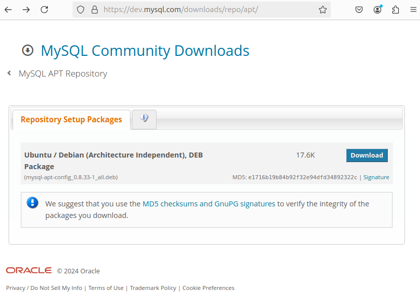
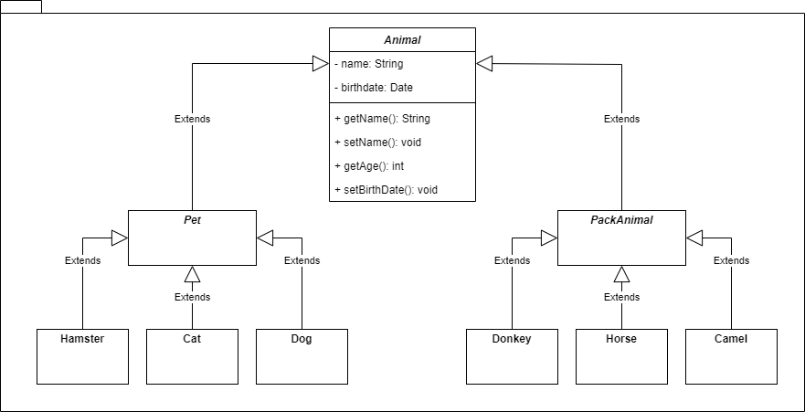
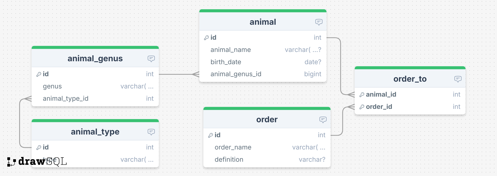

# Итоговая контрольная работа

## Информация о проекте

Необходимо организовать систему учета для питомника, в котором живут домашние и 
вьючные животные.

## Как сдавать проект

Для сдачи проекта необходимо создать отдельный общедоступный репозиторий (Github, 
gitlub или Bitbucket). Разработку вести в этом репозитории, использовать пул 
реквесты на изменения. Программа должна запускаться и работать, ошибок при 
выполнении программы быть не должно.\
Программа, может использоваться в различных системах, поэтому необходимо 
разработать класс в виде конструктора.

## Задание

### 1. Используя команду `cat` в терминале операционной системы Linux, создать два файла: `Домашние животные` - заполнив файл собаками, кошками, хомяками; `Вьючные животные` - заполнив файл лошадьми, верблюдами и ослами. Затем объединить их. Просмотреть содержимое созданного файла. Переименовать файл, дав ему новое имя (`Друзья человека`).

```sh
db@db-ubuntu24:~/Documents/developer_exam$ cat >> pets
животное;кличка;вес_кг           
собака;Шарик;24
кошка;Мурка;4,8    
хомяк;Илларион;0,05
собака;Жучка;17
кошка;Батон;6
хомяк;Фрося;0,04
```

```sh
db@db-ubuntu24:~/Documents/developer_exam$ cat >> pack_animals
лошадь;Тихон;583
лошадь;Буря;507
верблюд;Паша;700
верблюд;Ласточка;635
осёл;Мопед;184
осёл;Серена;147
```

```sh
db@db-ubuntu24:~/Documents/developer_exam$ cat pets pack_animals > human_friends
db@db-ubuntu24:~/Documents/developer_exam$ cat human_friends 
животное;кличка;вес_кг
собака;Шарик;24
кошка;Мурка;4,8
хомяк;Илларион;0,05
собака;Жучка;17
кошка;Батон;6
хомяк;Фрося;0,04
лошадь;Тихон;583
лошадь;Буря;507
верблюд;Паша;700
верблюд;Ласточка;635
осёл;Мопед;184
осёл;Серена;147
```

### 2. Создать директорию, переместить файл туда.

```sh
db@db-ubuntu24:~/Documents/developer_exam$ mkdir animals
db@db-ubuntu24:~/Documents/developer_exam$ mv human_friends pack_animals pets animals/
db@db-ubuntu24:~/Documents/developer_exam$ tree
.
├── animals
│   ├── human_friends
│   ├── pack_animals
│   └── pets
└── README.md
```

### 3. Подключить дополнительный репозиторий MySQL. Установить любой пакет из этого репозитория.



```sh
db@db-ubuntu24:~/Documents/developer_exam$ ls -al
total 48
drwxrwxr-x 5 db db  4096 Oct 26 21:16 .
drwxr-xr-x 4 db db  4096 Oct 24 18:49 ..
drwxrwxr-x 2 db db  4096 Oct 26 20:39 animals
drwxrwxr-x 8 db db  4096 Oct 26 20:42 .git
drwxrwxr-x 2 db db  4096 Oct 26 21:08 img
-rw-rw-r-- 1 db db 18072 Oct 26 21:11 mysql-apt-config_0.8.33-1_all.deb
-rw-rw-r-- 1 db db  6650 Oct 26 20:41 README.md
```

#### Устанавливаем скачанный пакет
```sh
db@db-ubuntu24:~/Documents/developer_exam$ sudo dpkg -i mysql-apt-config_0.8.33-1_all.deb
[sudo] password for db: 
Selecting previously unselected package mysql-apt-config.
(Reading database ... 205956 files and directories currently installed.)
Preparing to unpack mysql-apt-config_0.8.33-1_all.deb ...
Unpacking mysql-apt-config (0.8.33-1) ...
Setting up mysql-apt-config (0.8.33-1) ...
```

#### Убеждаемся, что репозиторий подключён
```sh
db@db-ubuntu24:~/Documents/developer_exam$ cd /etc/apt/sources.list.d
b@db-ubuntu24:/etc/apt/sources.list.d$ ls -al
total 28
drwxr-xr-x 2 root root 4096 Oct 26 21:20 .
drwxr-xr-x 9 root root 4096 Sep  3 22:09 ..
-rw-r--r-- 1 root root  117 Aug 29 07:38 docker.list
-rw-r--r-- 1 root root  642 Oct 26 21:20 mysql.list
-rw-r--r-- 1 root root  107 Aug  4 21:30 nginx.list
-rw-r--r-- 1 root root  386 Aug  4 18:11 ubuntu.sources
-rw-r--r-- 1 root root 2552 Apr 24  2024 ubuntu.sources.curtin.orig
db@db-ubuntu24:/etc/apt/sources.list.d$ cat mysql.list
### THIS FILE IS AUTOMATICALLY CONFIGURED ###
# You may comment out entries below, but any other modifications may be lost.
# Use command 'dpkg-reconfigure mysql-apt-config' as root for modifications.
deb [signed-by=/usr/share/keyrings/mysql-apt-config.gpg] http://repo.mysql.com/apt/ubuntu/ noble mysql-apt-config
deb [signed-by=/usr/share/keyrings/mysql-apt-config.gpg] http://repo.mysql.com/apt/ubuntu/ noble mysql-8.0
deb [signed-by=/usr/share/keyrings/mysql-apt-config.gpg] http://repo.mysql.com/apt/ubuntu/ noble mysql-tools
deb-src [signed-by=/usr/share/keyrings/mysql-apt-config.gpg] http://repo.mysql.com/apt/ubuntu/ noble mysql-8.0
```

#### Обновим список пакетов и установим MySQL
```sh
db@db-ubuntu24:/etc/apt/sources.list.d$ sudo apt update
db@db-ubuntu24:/etc/apt/sources.list.d$ sudo apt install mysql-server mysql-client
...
Need to get 33.8 MB of archives.
After this operation, 42.1 MB of additional disk space will be used.
Do you want to continue? [Y/n] y
Get:1 http://repo.mysql.com/apt/ubuntu noble/mysql-8.0 amd64 mysql-server amd64 8.0.40-1ubuntu24.04 [57.8 kB]
Get:2 http://repo.mysql.com/apt/ubuntu noble/mysql-8.0 amd64 mysql-common amd64 8.0.40-1ubuntu24.04 [59.1 kB]
Get:3 http://repo.mysql.com/apt/ubuntu noble/mysql-8.0 amd64 mysql-community-client amd64 8.0.40-1ubuntu24.04 [2,073 kB]
Get:4 http://repo.mysql.com/apt/ubuntu noble/mysql-8.0 amd64 mysql-community-client-plugins amd64 8.0.40-1ubuntu24.04 [1,377 kB]
Get:5 http://repo.mysql.com/apt/ubuntu noble/mysql-8.0 amd64 mysql-community-client-core amd64 8.0.40-1ubuntu24.04 [2,132 kB]
Get:6 http://repo.mysql.com/apt/ubuntu noble/mysql-8.0 amd64 mysql-client amd64 8.0.40-1ubuntu24.04 [57.8 kB]
Get:7 http://repo.mysql.com/apt/ubuntu noble/mysql-8.0 amd64 mysql-community-server-core amd64 8.0.40-1ubuntu24.04 [28.0 MB]
Get:8 http://repo.mysql.com/apt/ubuntu noble/mysql-8.0 amd64 mysql-community-server amd64 8.0.40-1ubuntu24.04 [69.4 kB]
Fetched 33.8 MB in 4s (9,262 kB/s)                     
Preconfiguring packages ...
...
```

#### Проверим статус
```sh
db@db-ubuntu24:/etc/apt/sources.list.d$ systemctl status mysql.service
● mysql.service - MySQL Community Server
     Loaded: loaded (/usr/lib/systemd/system/mysql.service; enabled; preset: enabled)
     Active: active (running) since Sat 2024-10-26 21:38:06 MSK; 7min ago
       Docs: man:mysqld(8)
             http://dev.mysql.com/doc/refman/en/using-systemd.html
   Main PID: 17683 (mysqld)
     Status: "Server is operational"
      Tasks: 37 (limit: 4614)
     Memory: 517.3M (peak: 517.8M)
        CPU: 21.518s
     CGroup: /system.slice/mysql.service
             └─17683 /usr/sbin/mysqld

Oct 26 21:37:42 db-ubuntu24 systemd[1]: Starting mysql.service - MySQL Community Server...
Oct 26 21:38:06 db-ubuntu24 systemd[1]: Started mysql.service - MySQL Community Server.
```

### 4. Установить и удалить deb-пакет с помощью `dpkg`.

В предыдущем пункте уже установили deb-пакет с помощью утилиты `dpkg`.

#### Удалим deb-пакет
```sh
db@db-ubuntu24:/etc/apt/sources.list.d$ sudo dpkg --purge mysql-apt-config
db@db-ubuntu24:/etc/apt/sources.list.d$ ls -al
total 24
drwxr-xr-x 2 root root 4096 Oct 26 21:59 .
drwxr-xr-x 9 root root 4096 Sep  3 22:09 ..
-rw-r--r-- 1 root root  117 Aug 29 07:38 docker.list
-rw-r--r-- 1 root root  107 Aug  4 21:30 nginx.list
-rw-r--r-- 1 root root  386 Aug  4 18:11 ubuntu.sources
-rw-r--r-- 1 root root 2552 Apr 24  2024 ubuntu.sources.curtin.orig
```
### 5. Выложить историю команд в терминале ubuntu.

```sh
db@db-ubuntu24:/etc/apt/sources.list.d$ history
 ...
 1299  mkdir developer_exam
 1300  cd developer_exam/
 ...
 1319  echo "# developer_exam" >> README.md
 1320  git init
 1321  git add README.md
 1322  git commit -m "first commit"
 1323  git branch -M main
 1324  git remote add origin https://github.com/nemirmg/developer_exam.git
 1325  git push -u origin main
 1326  git status
 1327  git add README.md 
 1328  git commit -m "Добавил описание"
 1329  git push
 1330  git pull
 1331  ls -al
 1332  cat >> pets
 1333  cat pets
 1334  cat >> pack_animals
 1335  cat pets pack_animals > human_friends
 1336  cat human_friends 
 1337  git status
 1338  git add .
 1339  git commit -m "Решение 1 задания"
 1340  git push
 1341  mkdir animals
 ...
 1346  mv human_friends pack_animals pets animals/
 1347  tree
 1348  git status
 1349  git add .
 1350  git commit -m "Решение 2 задания"
 1351  git push
 ...
 1365  ls -al
 1366  sudo dpkg -i mysql-apt-config_0.8.33-1_all.deb
 1367  cd /etc/apt
 1368  ls -al
 1369  cd sources.list.d/
 1370  ls -al
 1371  cat mysql.list
 1372  sudo apt update
 1373  sudo apt list --upgradable
 1374  sudo apt install mysql-server mysql-client
 1375  systemctl status mysql.service
 1376  sudo dpkg --purge mysql-apt-config
 1377  sudo dpkg -r mysql-apt-config
 1378  dpkg -l | grep mysql | grep ii
 1379  ls -al
 1380  git status
 1381  cd ~
 1382  cd documents/developer_exam
 1383  cd Documents/developer_exam
 1384  git status
 1385  git add .
 1386  git commit -m "Решение 3-4 заданий"
 1387  git push
 1388  git pull

```

### 6. Нарисовать диаграмму, в которой есть класс родительский класс, домашние животные и вьючные животные, в составы которых в случае домашних животных войдут классы: собаки, кошки, хомяки, а в класс вьючные животные войдут: лошади, верблюды и ослы.




### 7. В подключенном MySQL репозитории создать базу данных `Друзья человека`.

```sql
CREATE DATABASE IF NOT EXISTS human_friends;
USE human_friends;
```

### 8. Создать таблицы с иерархией из диаграммы в БД.



```sql
CREATE TABLE `animal_type`(
    `id` INT NOT NULL AUTO_INCREMENT,
    `type` VARCHAR(30) NOT NULL,
    PRIMARY KEY (`id`)
);

CREATE TABLE `animal_genus`(
    `id` INT NOT NULL AUTO_INCREMENT,
    `genus` VARCHAR(30) NOT NULL,
    `animal_type_id` INT NOT NULL,
    PRIMARY KEY(`id`),
    FOREIGN KEY(`animal_type_id`) REFERENCES `animal_type`(`id`)
    ON DELETE CASCADE ON UPDATE CASCADE
);

CREATE TABLE `animal`(
    `id` INT NOT NULL AUTO_INCREMENT,
    `animal_name` VARCHAR(30) NULL,
    `birth_date` DATE NULL,
    `animal_genus_id` INT NOT NULL,
    PRIMARY KEY (`id`),
    FOREIGN KEY(`animal_genus_id`) REFERENCES `animal_genus`(`id`)
    ON DELETE CASCADE ON UPDATE CASCADE
);

CREATE TABLE `order`(
    `id` INT NOT NULL AUTO_INCREMENT,
    `order_name` VARCHAR(30) NOT NULL,
    `definition` VARCHAR(255) NULL,
    PRIMARY KEY (`id`)
);

CREATE TABLE `order_to`(
    `animal_id` INT NOT NULL,
    `order_id` INT NOT NULL,
    PRIMARY KEY(`animal_id`, `order_id`),
    FOREIGN KEY(`animal_id`) REFERENCES `animal`(`id`)
    ON DELETE CASCADE ON UPDATE CASCADE,
    FOREIGN KEY(`order_id`) REFERENCES `order`(`id`)
    ON DELETE CASCADE ON UPDATE CASCADE
);
```

9. Заполнить низкоуровневые таблицы именами (животных), командами которые они 
выполняют и датами рождения
10. Удалив из таблицы верблюдов, т.к. верблюдов решили перевезти в другой 
питомник на зимовку. Объединить таблицы лошади, и ослы в одну таблицу.
11. Создать новую таблицу `молодые животные` в которую попадут все животные 
старше 1 года, но младше 3 лет и в отдельном столбце с точностью до месяца 
подсчитать возраст животных в новой таблице.
12. Объединить все таблицы в одну, при этом сохраняя поля, указывающие на
прошлую принадлежность к старым таблицам.
13. Создать класс с инкапсуляцией методов и наследованием по диаграмме.
14. Написать программу, имитирующую работу реестра домашних животных.\
В программе должен быть реализован следующий функционал:
    1. Завести новое животное.
    2. Определять животное в правильный класс.
    3. Увидеть список команд, которое выполняет животное.
    4. Обучить животное новым командам.
    5. Реализовать навигацию по меню.

15. Создайте класс `Счетчик`, у которого есть метод `add()`, увеличивающий̆ 
значение внутренней̆ `int` переменной̆ на 1 при нажатие `Завести новое животное`. 
Сделайте так, чтобы с объектом такого типа можно было работать в блоке 
`try-with-resources`. Нужно бросить исключение, если работа с объектом типа 
счетчик была не в ресурсном `try` и/или ресурс остался открыт. Значение считать 
в ресурсе `try`, если при заведения животного заполнены все поля.
